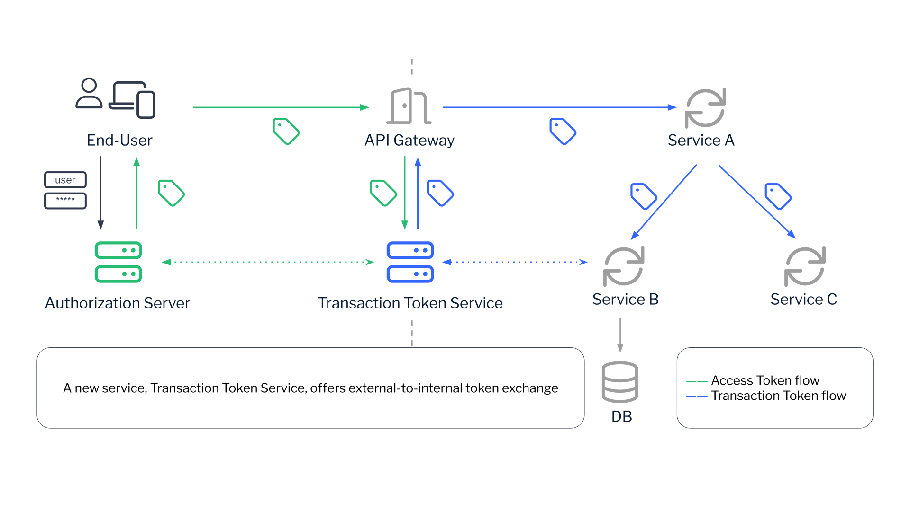

This is a Keycloak implementation of the [Transaction Tokens](https://datatracker.ietf.org/doc/draft-ietf-oauth-transaction-tokens/) Internet Draft.

## Overview

The draft introduces a concept of a Transaction Token (Txn-Token), which encapsulates the data related to the requesting user (human), requesting workload (non-human) and the transaction itself, and preserves it throughout the entire call chain:
> Transaction Tokens (Txn-Tokens) are designed to maintain and propagate
> user identity, workload identity and authorization context throughout
> the Call Chain within a trusted domain during the processing of external
> requests (e.g. such as API calls) or requests initiated internally
> within the trust domain. Txn-Tokens ensure that this context is
> preserved throughout the Call Chain thereby enhancing security and
> consistency in complex, multi-service architectures.

The draft also introduces Transaction Token Service (TTS), an OAuth 2.0 compliant service that issues Txn-Tokens via OAuth 2.0 Token Exchange. The diagram below shows the typical deployment and data flow for Transaction Tokens:


### Standard Flow
> [!NOTE]
> Legend:  
> AT = Access Token  
> TT = Transaction Token  
> RCTX = request context (user IP address, auth details…)  
> TCTX = transaction context (amount, …)


## Build

```
# Main JAR
mvn clean install

# Docker images
mvn docker:build
```

The main build will generate the provider JAR in `target`.

The Docker build will generate two images (`XXX` is Keycloak version, `YYY` is TTS version):
- `carretti/keycloak-tts:XXX-YYY` - Keycloak image with embedded TTS provider
- `carretti/keycloak-tts-init:XXX-YYY` - init container image for Kubernetes (provider JAR only)

## Deploy

### Standalone

Copy the `target/keycloak-tts-YYY.jar` into the `providers` directory and restart Keycloak.

### Docker

You can either use the image with embedded TTS provider:

```
docker run carretti/keycloak-tts:26.6.0-latest start
```

or mount the provider as a JAR into the `providers` directory of the official Keycloak image:

```
docker run -v $(pwd)/target/keycloak-tts-1.0.0-SNAPSHOT.jar:/opt/keycloak/providers/keycloak-tts.jar quay.io/keycloak/keycloak:26.6.0 start-dev
```

### Kubernetes

On Kubernetes, you can use init container image with your favorite Keycloak Helm chart.
  
Example use (with [Codecentric Keycloak.x](https://artifacthub.io/packages/helm/codecentric/keycloakx) chart):
```yaml
extraInitContainers: |
  - name: keycloak-tts
    image: carretti/keycloak-tts-init
    imagePullPolicy: IfNotPresent
    command:
      - sh
    args:
      - -c
      - |
        echo "Copying providers..."
        cp -R /tmp/providers/* /providers/
    volumeMounts:
      - name: providers
        mountPath: /providers
extraVolumeMounts: |
  - name: providers
    mountPath: /opt/keycloak/providers
extraVolumes: |
  - name: providers
    emptyDir: {}

```

## Configuration   

### Identity Provider
To enable Transaction Token Service, create an OpenID Connect Identity Provider and name it `tts`:


The name `tts` is currently hardcoded, and will be used by the implementation to resolve the identity provider. In the future, Keycloak will have a dedicated "Transaction Token Service" identity provider type.

### Allowed Audience
As per [12.1. Txn-Token Request](https://www.ietf.org/archive/id/draft-ietf-oauth-transaction-tokens-08.html#name-txn-token-request), the `audience` parameter is mandatory, and must be set to the Trust Domain name.

 In Keycloak TTS, this configuration option is also mandatory. Currently, it does not have a UI. To configure trust domain / allowed audience, please use the `kcadm` tool:
 ```
 $ bin/kcadm.sh config credentials --server ${KEYCLOAK_URL} --realm master --user ${KEYCLOAK_ADMIN_USERNAME} --password ${KEYCLOAK_ADMIN_PASSWORD}
 $ bin/kcadm.sh update -r ${TTS_REALM} identity-provider/instances/tts -s 'config."tts.audience"=example.org'
```
